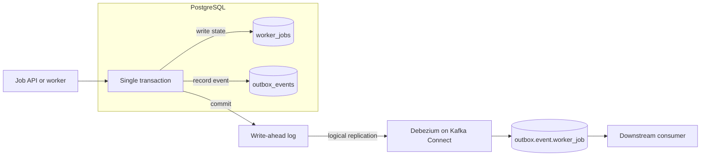

# PostgreSQL Outbox Debezium Demo

- Local CDC demo for a job-processing service.
- The application writes a job state change and integration event in one PostgreSQL transaction.
- Debezium relays committed outbox events to Kafka.



## Prerequisites

- Install Docker Desktop or [OrbStack](https://orbstack.dev/download) before running the demo.

## Run the demo

Start the infrastructure and wait until PostgreSQL and Kafka are healthy:

```shell
docker compose up -d
```

Apply the connector. The script uses `PUT`, so you can run it again after
editing the connector configuration.

```shell
./bin/apply-connector.sh
```

Open a PostgreSQL shell:

```shell
docker compose exec database psql -U app_user -d worker_service
```

Create a queued job and its business event. The `pgcrypto` extension in the
bootstrap schema provides `gen_random_uuid()`.

```sql
SELECT gen_random_uuid() AS job_id, gen_random_uuid() AS event_id \gset

BEGIN;

INSERT INTO worker_jobs (id, job_type, payload)
VALUES (
  :'job_id',
  'send_email',
  jsonb_build_object('recipient', 'foo@example.com', 'template', 'welcome')
);

INSERT INTO outbox_events (id, aggregate_type, aggregate_id, type, payload)
VALUES (
  :'event_id',
  'worker_job',
  :'job_id',
  'WorkerJobAccepted',
  jsonb_build_object(
    'jobId', :'job_id',
    'jobType', 'send_email',
    'status', 'queued',
    'recipient', 'foo@example.com'
  )
);

COMMIT;
```

Then model a worker beginning the job. Only intentionally emitted business
events enter the outbox; routine row updates do not automatically become
integration events.

```sql
SELECT gen_random_uuid() AS event_id \gset

BEGIN;

UPDATE worker_jobs
SET status = 'running',
    worker_id = 'worker-1',
    attempts = attempts + 1,
    updated_at = CURRENT_TIMESTAMP
WHERE id = :'job_id';

INSERT INTO outbox_events (id, aggregate_type, aggregate_id, type, payload)
VALUES (
  :'event_id',
  'worker_job',
  :'job_id',
  'WorkerJobStarted',
  jsonb_build_object('jobId', :'job_id', 'workerId', 'worker-1', 'attempt', 1)
);

COMMIT;
```

Browse Kafka UI at http://localhost:8888 and inspect
`outbox.event.worker_job`.

Adminer provides a PostgreSQL browser at http://localhost:8889. Select
`PostgreSQL`, then sign in with server `database`, user `app_user`, password
`local_app_password`, and database `worker_service`.

## The relay contract

The connector configuration lives in
[`infrastructure/connect/worker-outbox-connector.json`](infrastructure/connect/worker-outbox-connector.json).
It reads the `worker_outbox_publication`, which includes only
`public.outbox_events`, through PostgreSQL logical replication.

`aggregate_type` selects the output topic suffix and `aggregate_id` becomes
the Kafka record key. Events for one job therefore share a Kafka key. The
application-generated `outbox_events.id` is the event identity consumers use to
deduplicate at-least-once delivery.

## Clear or reset data

To delete the jobs and outbox events while keeping the schema and containers,
run this in PostgreSQL:

```sql
DELETE FROM outbox_events;
DELETE FROM worker_jobs;
```

To rebuild PostgreSQL from `infrastructure/postgres/01-schema.sql`, run this
from your host shell. It removes the Compose volumes, including local Kafka
topics and Kafka Connect offsets, so Debezium starts from a clean state.

```shell
docker compose down -v --remove-orphans
docker compose up -d
./bin/apply-connector.sh
```

To remove only PostgreSQL data from the host, stop the stack and remove its
named volume:

```shell
docker compose down
docker volume rm postgres-outbox-debezium-demo_database-data
docker compose up -d
```

Use the full reset when possible. Keeping Kafka Connect offsets after
recreating PostgreSQL can leave the connector with a stale log position.
